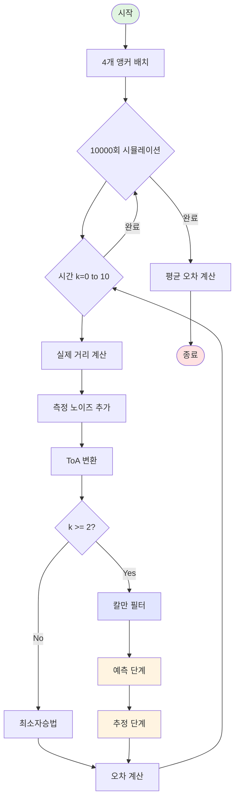

# Kalman_Filter_ToA

```mermaid
flowchart TD
    Start([시작]) --> Init[4개 앵커 배치]
    Init --> SimLoop{10000회 시뮬레이션}
    
    SimLoop --> TimeLoop{시간 k=0 to 10}
    
    TimeLoop --> CalcDist[실제 거리 계산]
    CalcDist --> AddNoise[측정 노이즈 추가]
    AddNoise --> ToA[ToA 변환]
    
    ToA --> CheckK{k >= 2?}
    
    CheckK -->|No| LSE[최소자승법]
    CheckK -->|Yes| KF[칼만 필터]
    
    KF --> Predict[예측 단계]
    Predict --> Update[추정 단계]
    
    LSE --> CalcError[오차 계산]
    Update --> CalcError
    
    CalcError --> TimeLoop
    
    TimeLoop -->|완료| SimLoop
    SimLoop -->|완료| AvgError[평균 오차 계산]
    
    AvgError --> End([종료])
    
    style Start fill:#e1f5e1
    style End fill:#ffe1e1
    style KF fill:#e1e5ff
    style Predict fill:#fff4e1
    style Update fill:#fff4e1
```
