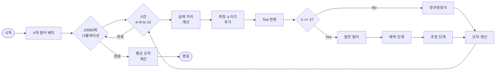
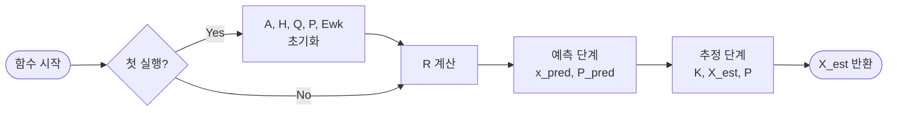

# Kalman_Filter_ToA



## 칼만 필터 함수 흐름도




## 초기화 상세


## 시스템 모델

### 앵커 배치
```
Anchor 2 (10,10) -------- Anchor 1 (0,10)
    |                          |
    |        Object            |
    |         (k,k)            |
    |                          |
Anchor 4 (10,0)  -------- Anchor 3 (0,0)
```

### 상태 공간 모델

**상태 벡터:**
```
X_k = [x_k, y_k]^T  (물체의 2D 위치)
```

**상태 천이 모델:**
```
X_k = A * X_{k-1} + (X_{k-1} - X_{k-2}) + w_k

여기서:
- A = I_2 (2x2 단위행렬)
- (X_{k-1} - X_{k-2}): 등속 운동 가정
- w_k ~ N(E[w_k], Q): 프로세스 노이즈
```

**측정 모델:**
```
z_k = H * X_k + v_k

여기서:
- z_k: 6x1 벡터 (앵커 쌍 간 거리 차이의 제곱)
- H: 6x2 측정 행렬
- v_k ~ N(0, R): 측정 노이즈
```

### 주요 행렬

**측정 행렬 H (6x2):**
```
H = -2 * [
    (0-10),  (10-10);   % Anchor 1-2
    (0-0),   (10-0);    % Anchor 1-3
    (0-10),  (10-0);    % Anchor 1-4
    (10-0),  (10-0);    % Anchor 2-3
    (10-10), (10-0);    % Anchor 2-4
    (0-10),  (0-0)      % Anchor 3-4
]
```

**프로세스 노이즈 공분산 Q (2x2):**
```
시뮬레이션을 통해 sigma별로 사전 계산됨:

sigma^2 = 10^-2: Q = [0.0429, -0.0003; -0.0003, 0.0425]
sigma^2 = 10^-1: Q = [0.4215,  0.0000;  0.0000, 0.4250]
sigma^2 = 10^0:  Q = [4.2001,  0.0562;  0.0562, 4.2879]
sigma^2 = 10^1:  Q = [44.0896, 0.1916;  0.1916, 45.4973]
sigma^2 = 10^2:  Q = [692.67, -5.5408; -5.5408, 691.00]
```

**측정 노이즈 공분산 R (6x6):**
```
R = 4 * sigma^2 * [
    (Z1^2 + Z2^2),  Z1^2,           Z1^2,          -Z2^2,          -Z2^2,           0;
    Z1^2,           (Z1^2 + Z3^2),  Z1^2,          Z3^2,           0,              -Z3^2;
    Z1^2,           Z1^2,           (Z1^2 + Z4^2), 0,              Z4^2,            Z4^2;
   -Z2^2,           Z3^2,           0,             (Z2^2 + Z3^2),  Z2^2,           -Z3^2;
   -Z2^2,           0,              Z4^2,          Z2^2,           (Z2^2 + Z4^2),   Z4^2;
    0,             -Z3^2,           Z4^2,         -Z3^2,           Z4^2,            (Z3^2 + Z4^2)
]

여기서 Z = [Z1, Z2, Z3, Z4]^T는 각 앵커의 측정 거리
```

**초기 오차 공분산 P (2x2):**
```
sigma에 따라 사전 계산된 값 사용
```

**프로세스 노이즈 평균 E[w_k]:**
```
sigma^2 = 10^-2: E[w_k] = [-0.0018; -0.8846] * 10^-3
sigma^2 = 10^-1: E[w_k] = [0.0116; 0.0046]
sigma^2 = 10^0:  E[w_k] = [-0.0177; 0.0092]
sigma^2 = 10^1:  E[w_k] = [0.0139; 0.1614]
sigma^2 = 10^2:  E[w_k] = [-0.1293; 0.1903]
```

### 칼만 필터 수식

**예측 단계:**
```
X_pred = A * X_k + (X_k - X_{k-1}) + E[w_k]
P_pred = A * P * A^T + Q
```

**추정 단계:**
```
K = P_pred * H^T * (H * P_pred * H^T + R)^-1  (칼만 게인)
X_est = X_pred + K * (z_k - H * X_pred)        (상태 추정)
P = P_pred - K * H * P_pred                     (공분산 업데이트)
```

### ToA 변환

**측정값 z_k (6x1):**
```
z_k = [
    Z1^2 - Z2^2 + d1^2;
    Z1^2 - Z3^2 - d2^2;
    Z1^2 - Z4^2 - (d2^2 - d1^2);
    Z2^2 - Z3^2 - (d1^2 + d2^2);
    Z2^2 - Z4^2 - d2^2;
    Z3^2 - Z4^2 + d1^2
]

여기서 d1 = d2 = 10
```

### 오차 계산

```
Error = sqrt((X_est[x] - x_real)^2 + (X_est[y] - y_real)^2)

최종 평균 오차 = 총 오차 / (11 steps * 10000 simulations)
```
